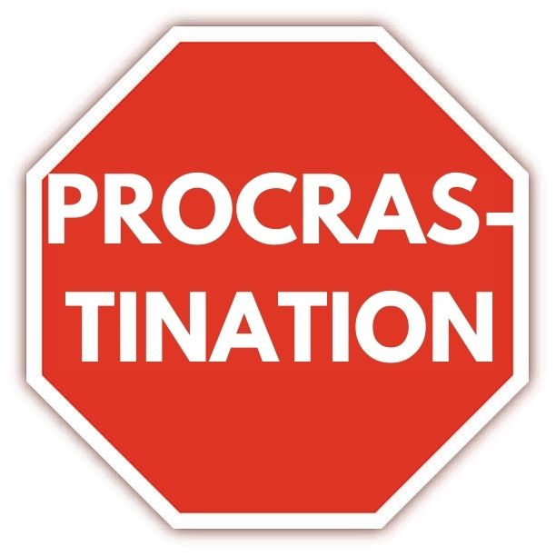
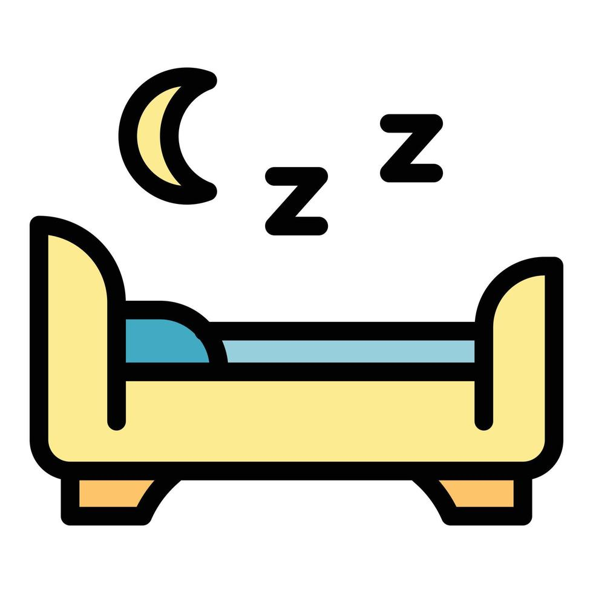
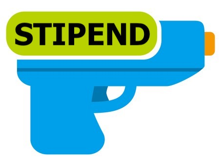

# Student vs Life

Welcome to "Student vs Life" - a game where you must conquer the relentless challanges of student life!

In this game, your objective is to survive "fadder" week and three years of your bachelor's degree with only three "konte" attempts. The constant attacks from "life" require you to strategically place student entities that help you stop these challenges.

## How to play:
Click on the desired student entity, then place it on the screen to defend against attacks. After each year, you’ll unlock new student entities to help you fight back, with the game guiding you through info screens as you progress.
Sleep is your currency in this game. The amount of sleep you have available to purchase new entities is displayed in the top-right corner. The sleep amount will reset at the start of each year.

Pro tip: You can use <I> Bed's </I>  to generate more sleep during a year, helping you purchase more student entities to strengthen your defense.

## Student entities available:
Bed: Generates sleep, the primary in-game currency.

Stipend Gun: Shoots coins at life attackers.

Procrastination: Temporarily delays life attackers.

Echo: Shoots pizza at life attackers.

## Visual demo
You can view a visual demo of the game [here]( https://youtu.be/VjRZuAuTEJk?si=N4l10gj19Pb90Dg2).

## Copyright 
"Student vs Life" is heavily inspired by the game Plants vs Zombies. All rights for "Plants vs Zombies" belong to its respective creators.

